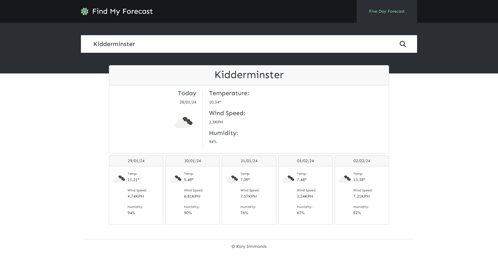

# find-my-forecast

An interactive webpage that allows visitors to find weather forecasts by location.

## Description

This repository contains a simple browser tool that allows visitors to find weather forecasts by location. Upon entering their chosen location, the site performs basic validation on the input and then makes calls to 3 separate APIs from the api.openweathermap.org website.

Upon making successful calls , the current and 5 day forecast are dynamically displayed.

The users search history is saved to the browsers local storage, and is displayed in a box, allowing users to easily search that location again.

The application was built using HTML, CSS, Javascript, Jquery, JqueryUI, DayJS and Bootstrap.

Features include:
* A search box that dynamically updates the page upon entering a location
* A current and 5 day forecast
* Simple, modern styling
* Previous search history

## Links

[Link to the deployed site](https://uberponky.github.io/Find-My-Forecast/)

[Link to the GitHub repository](https://github.com/uberponky/Find-My-Forecast)

## Installation

Access the deployed website via the links above. You can also clone the repository via Github and deploy locally to view the site.

## Usage

Once accessed / deployed, click on the input field in the center and type in your required location.

Select the magnifying glass on the right to submit your entry.

Click on the input field to see previous searches.

## Credits

N/A

## Contributing

N/A

## License

MIT License

Copyright (c) 2023 Rory Simmonds

Permission is hereby granted, free of charge, to any person obtaining a copy
of this software and associated documentation files (the "Software"), to deal
in the Software without restriction, including without limitation the rights
to use, copy, modify, merge, publish, distribute, sublicense, and/or sell
copies of the Software, and to permit persons to whom the Software is
furnished to do so, subject to the following conditions:

The above copyright notice and this permission notice shall be included in all
copies or substantial portions of the Software.

THE SOFTWARE IS PROVIDED "AS IS", WITHOUT WARRANTY OF ANY KIND, EXPRESS OR
IMPLIED, INCLUDING BUT NOT LIMITED TO THE WARRANTIES OF MERCHANTABILITY,
FITNESS FOR A PARTICULAR PURPOSE AND NONINFRINGEMENT. IN NO EVENT SHALL THE
AUTHORS OR COPYRIGHT HOLDERS BE LIABLE FOR ANY CLAIM, DAMAGES OR OTHER
LIABILITY, WHETHER IN AN ACTION OF CONTRACT, TORT OR OTHERWISE, ARISING FROM,
OUT OF OR IN CONNECTION WITH THE SOFTWARE OR THE USE OR OTHER DEALINGS IN THE
SOFTWARE.
